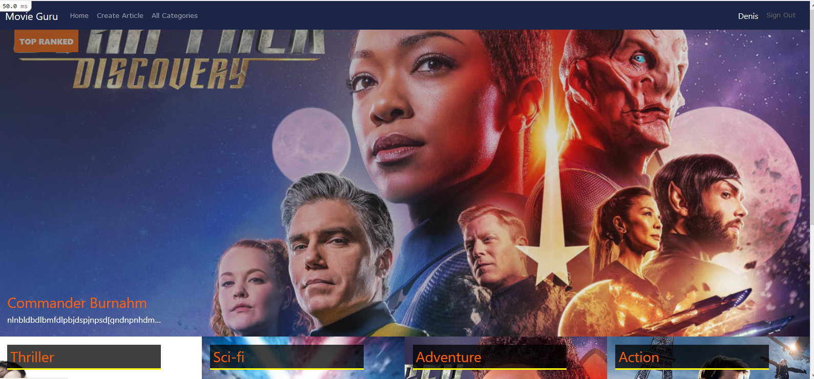
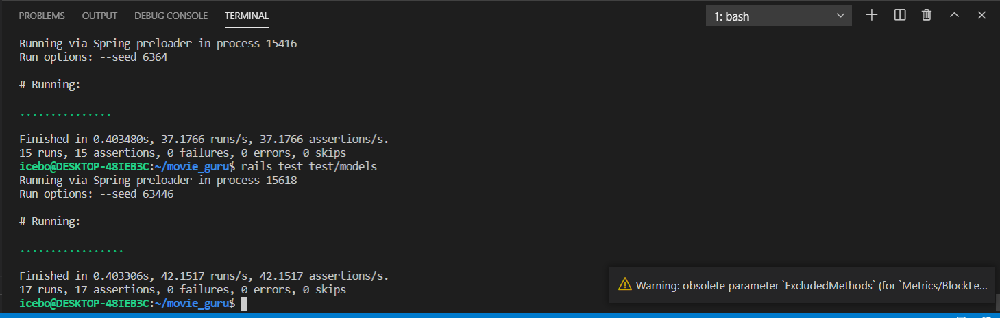

# Movie Guru Blog website

## About

This project is a blog about movies where users can create an account, signing in, writing an article about a movie, and vote for a movie.
The movie with the highest rank will be displayed in the Top-ranked section on the home page.

## Credit design
- Design idea by [Nelson Sakwa on Behance](https://www.behance.net/sakwadesignstudio)

## 🔨 Tested with
    Ruby gem shoulda Matchers
    Ruby gem capybara

## Prerequisites

Ruby: 2.7.2 Rails: 6.1.1 Postgres: >=13

## Usage

- Open a terminal.
- Clone the repo by typing that command `git clone https://github.com/icebox827/movie_guru` 
- Run `bundle install` in your terminal
- Run `db:create` in your terminal to create the database
- Run `db:migrate` in your terminal to migrate the database
- Run `rails s`
- Start your localhost on 3000 port in your browser: "http://127.0.0.1:3000"
- Register with name, create articles and vote for articles!

## Live demo
[Just click here!](https://www.loom.com/share/be53de7e498f416e8c7433a86afee15e)

## Technologies

- Ruby
- Rails
- PostgreSQL
- VSCode
- Bootstrap
- Font Awesome

## Author

👤 **Denis Lafontant**

- GitHub: [@icebox827](https://github.com/icebox827)
- Twitter: [@heracles2k5](https://twitter.com/@heracles2k5)
- LinkedIn: [LinkedIn](https://www.linkedin.com/in/denis-lafontant/)

## 🤝 Contributing

Contributions, issues, and feature requests are welcome!

Feel free to check the [issues page](https://github.com/icebox827/movie_guru/issues/1).

## Show your support

Give a ⭐️ if you like this project!

### Acknowledgements

- Microverse
- The Odin Project
- Notion

## 📝 License

This project is [MIT](./LICENSE) licensed.